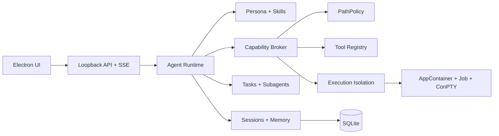

<div align="center">
  

  # Mini-Lux

  **一个面向真实工作的本地优先 AI Agent 桌面运行时**

  *A local-first AI agent desktop runtime built for real work.*

  [](https://www.typescriptlang.org/)
  [](https://www.electronjs.org/)
  [](https://nodejs.org/)
  [](#环境要求)
  [](#项目状态)

  [功能亮点](#功能亮点) · [快速开始](#快速开始) · [安全架构](#安全架构) · [项目状态](#项目状态) · [项目文档](#项目文档)
</div>

---

## 关于 Mini-Lux

Mini-Lux 是一个以 **Lux Desktop v0.1.898** 为行为基线构建的微型 AI Agent 系统。它不是简单的聊天界面，而是一套能够管理会话、调用工具、处理文件、维护记忆、拆解任务、调度子 Agent，并在桌面环境中持续工作的 Agent Runtime。

项目坚持三个核心方向：

- **本地优先**：会话、配置、记忆与工作数据保存在本地受管目录中。
- **能力可治理**：工具调用、路径访问和进程执行均经过明确的授权边界。
- **证据驱动**：功能完成度以契约、负向测试、真实环境回执和打包验证为准，而不是只看“代码能跑”。

> [!IMPORTANT]
> Mini-Lux 仍处于积极开发阶段。项目目标是逐步达到 Lux Desktop 的行为对齐，但当前不宣称已经完成 100% parity，也不建议将未审计构建直接用于高风险生产环境。

## 功能亮点

<table>
<tr>
<td width="50%" valign="top">

### 🧠 Agent Runtime

- 多会话管理与会话导入、导出、分叉
- Persona 与 Skill 动态组合
- 长对话压缩与持久化记忆
- 任务拆解、依赖追踪与执行状态管理
- 子 Agent 派遣、观察、通信与终止

</td>
<td width="50%" valign="top">

### 🛠️ 工具系统

- 文件读取、搜索、精确编辑与写入
- Shell、持久终端与 Node.js Script
- Web 获取、搜索与文件下载
- DOCX / XLSX 文档生成
- 定时任务、Playbook、Oracle 与跨会话通信

</td>
</tr>
<tr>
<td width="50%" valign="top">

### 🔐 安全边界

- Capability Broker 统一能力授权
- PathPolicy 路径身份校验与作用域隔离
- Windows AppContainer + Job Object 执行隔离
- Electron 主进程私有认证与人工执行同意链
- 执行清单、攻击矩阵与原生真实性回执

</td>
<td width="50%" valign="top">

### 🖥️ 桌面体验

- Electron 桌面应用
- 流式响应与工具调用可视化
- Persona、模型与工作目录设置
- 会话、任务、记忆和文件查看界面
- NSIS 安装包构建与完整性检查

</td>
</tr>
</table>

## 架构概览



Mini-Lux 将“模型决定做什么”和“系统允许做什么”分离：LLM 只能提出工具调用，实际参数校验、路径授权、运行时所有权和执行隔离由宿主系统完成。

## 环境要求

当前完整构建链面向 **Windows x64**，并锁定以下主要环境：

| 组件 | 要求 |
|---|---|
| 操作系统 | Windows 10 / 11 x64 |
| Node.js | `>=24.14.1 <25` |
| npm | `>=11.11.0 <12` |
| Visual Studio | 2022，安装“使用 C++ 的桌面开发” |
| MSVC Toolset | `14.43.34808` |
| Windows SDK | `10.0.22621.0` |

原生隔离组件使用固定工具链构建；版本或产物身份不匹配时，检查会失败关闭，而不会静默降级为普通子进程。

## 快速开始

### 1. 克隆并安装依赖

```powershell
git clone https://github.com/m1rzen/mini-lux.git
cd mini-lux
npm ci
```

> 当前仓库为 Private，克隆前需要登录具有访问权限的 GitHub 账号。

### 2. 配置模型

开发态默认从项目根目录的 `config.json` 读取配置：

```powershell
Copy-Item config.example.json config.json
```

然后填写 OpenAI-compatible Provider 的模型、API Key 与 Base URL：

```json
{
  "defaultProfile": "deepseek",
  "profiles": {
    "deepseek": {
      "model": "your-model-name",
      "apiKey": "your-api-key",
      "baseURL": "https://your-provider.example/v1"
    }
  }
}
```

`config.json`、`.env`、数据库和其他本地运行数据均已被 Git 忽略，请勿将真实密钥提交到仓库。

也可以在首次启动时通过环境变量提供配置：

```powershell
$env:LLM_API_KEY = "your-api-key"
$env:LLM_BASE_URL = "https://your-provider.example/v1"
$env:LLM_MODEL = "your-model-name"
```

### 3. 启动桌面应用

```powershell
npm run electron:dev
```

该命令会构建原生隔离组件、生成构建身份、编译 TypeScript，然后启动 Electron。

如只需启动开发服务器：

```powershell
npm run dev
```

默认仅监听 `http://127.0.0.1:3111`。

## 常用命令

| 命令 | 说明 |
|---|---|
| `npm run typecheck` | TypeScript 类型检查 |
| `npm run lint` | ESLint 严格检查 |
| `npm run build` | 构建服务端、原生组件与完整性清单 |
| `npm run electron:dev` | 构建并启动桌面应用 |
| `npm run dist:dir` | 生成未安装的 Electron 目录构建 |
| `npm run dist` | 生成 Windows NSIS 安装包 |
| `npm run test:quick` | 快速验证配置 |
| `npm test` | 完整分层测试门禁 |
| `npm run test:coverage` | 运行冻结覆盖率门禁 |
| `npm run parity:verify` | 验证锁定的 Lux Desktop 基线 |
| `npm run gate:gov04` | 运行合并治理门禁 |

完整门禁包含 Unit、Contract、Integration、Electron、Packaged、Coverage 与治理自测；部分测试需要 Windows 原生工具链或已构建的安装候选。

## 安全架构

Mini-Lux 将安全约束作为运行时设计的一部分，而不是只依赖 Prompt：

1. **Capability Broker**：按 Session、Persona、工具和调用上下文决定能力是否可见、可执行。
2. **PathPolicy**：使用受管根目录和对象身份校验限制文件访问，阻断路径穿越、链接逃逸与根目录替换。
3. **Execution Isolation**：受治理的执行入口通过 Windows AppContainer、Job Object 与 ConPTY 运行，限制文件、网络、环境变量和进程生命周期。
4. **Private Consent Chain**：人工终端操作需要 Electron 主进程参与的短时同意，授权不会暴露给 Renderer 或普通 HTTP 调用方。
5. **Evidence Gates**：执行 sink inventory、攻击矩阵、真实宿主回执和候选身份绑定共同决定测试是否可以宣告通过。

详细设计请参阅：

- [`SEC-01 Capability Broker`](parity/SEC-01-CAPABILITY-BROKER-ARCHITECTURE.md)
- [`SEC-02 PathPolicy`](parity/SEC-02-PATH-POLICY-ARCHITECTURE.md)
- [`SEC-03 Execution Isolation`](parity/SEC-03-EXECUTION-ISOLATION-ARCHITECTURE.md)
- [`GOV-04 CI Architecture`](parity/GOV-04-CI-ARCHITECTURE.md)

如果发现安全问题，请不要在公开 Issue 中披露密钥、用户数据或可直接利用的攻击细节；请通过仓库所有者提供的私有渠道报告。

## 项目状态

| 工作流 | 当前状态 |
|---|---|
| GOV-01～GOV-04 治理基础 | 已建立基线、版本、测试和发布治理框架 |
| SEC-01 Capability Broker | 已实现并具备契约与攻击性测试 |
| SEC-02 PathPolicy | 已实现并完成候选门禁闭合 |
| SEC-03 Execution Isolation | **进行中**：原生隔离与真实性原语已建立，完整真实宿主回执集仍待闭合 |
| Lux Desktop 全量 Parity | **进行中**，以 canonical execution spec 为唯一完成度依据 |

项目不会将“已实现”自动等同于“已完成”。只有源码、正式打包候选、负向测试、恢复场景与独立复核都满足冻结门禁后，工作项才可以提升状态。

## 项目结构

```text
mini-lux/
├─ electron/          # Electron 主进程、preload 与桌面启动链
├─ native/            # Windows AppContainer / Job / ConPTY 原生宿主
├─ parity/            # Lux 基线、架构冻结、Schema 与治理报告
├─ personas/          # 内建 Persona
├─ public/            # Web UI 与静态资源
├─ scripts/           # 构建、测试、治理与完整性工具
├─ skills/            # 可组合 Skill
├─ src/               # Agent Runtime 与工具实现
└─ tests/             # Unit / Contract / Integration / Electron / Packaged
```

## 项目文档

- [100% Parity 总执行规范](LUX-DESKTOP-100-PARITY-EXECUTION-SPEC.md)
- [历史差距分析](GAP-ANALYSIS.md)
- [Lux Desktop 基线说明](parity/README.md)
- [GOV-03 测试架构](parity/GOV-03-TEST-ARCHITECTURE.md)
- [GOV-04 CI 与发布架构](parity/GOV-04-CI-ARCHITECTURE.md)

## 贡献约定

在提交改动前，请至少运行：

```powershell
npm run typecheck
npm run lint
npm run test:quick
```

安全边界、路径策略、进程执行或发布链相关改动还必须更新对应契约、攻击矩阵与真实环境证据。不要提交 `.env`、`config.json`、数据库、模型文件、构建产物或包含真实用户数据的测试材料。

---

<div align="center">
  <strong>Mini-Lux</strong> — 为复杂工作带来清晰、秩序与可验证的执行力。
</div>
